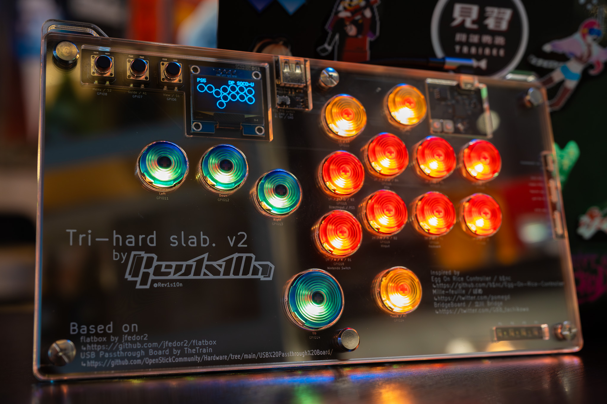
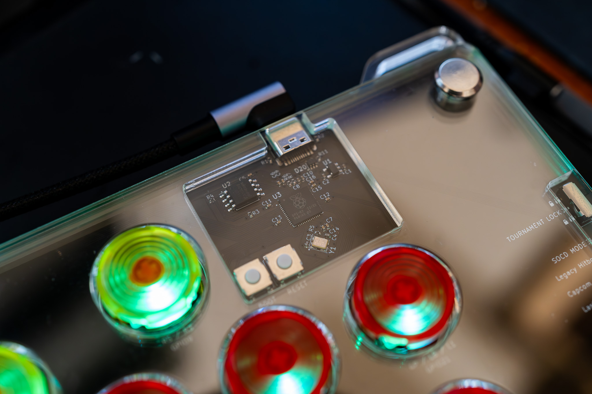
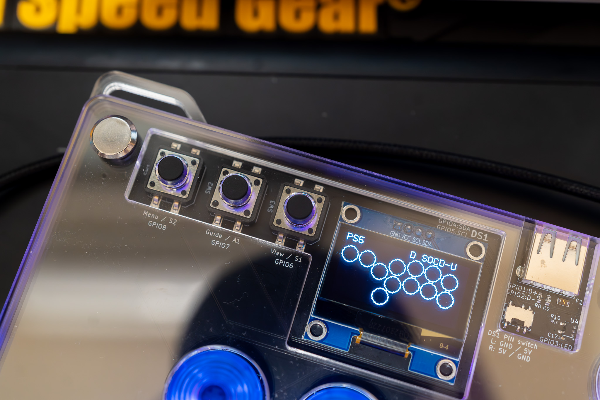
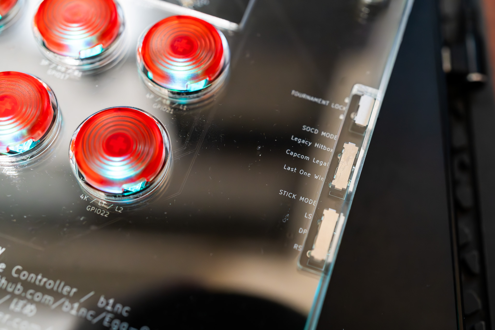
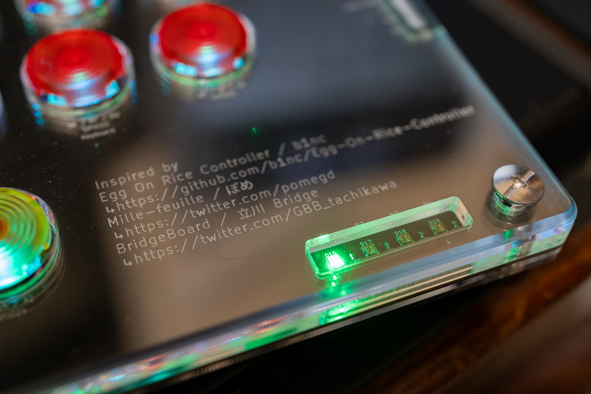
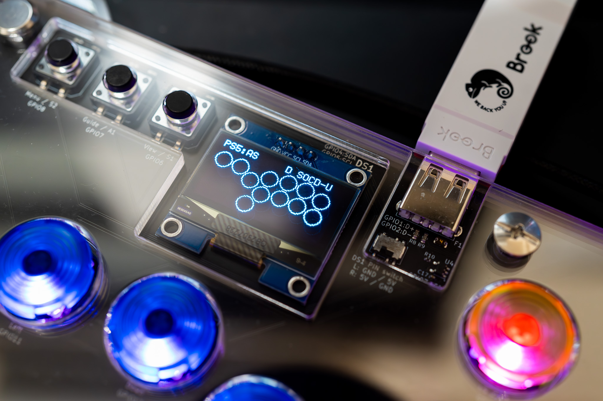

# Tri-Hard slab v2
## **English | [繁體中文](README_zh-TW.md)**
Slim all button controller powered by [GP2040-CE](https://gp2040-ce.info/) firmware (v0.7.5), with custom 15 buttons layout mainly for Street Fighter 6 and upcoming games that may support additional keybinding.

Mainly inspired by [Egg On Rice Controller](https://github.com/b1nc/Egg-On-Rice-Controller) by [b1nc](https://github.com/b1nc), [Mille-feuille](https://pomegd.booth.pm/items/2685530) by [ぽめ](https://twitter.com/pomegd) and [BridgeBoard](https://bridgeshop.booth.pm/items/4869470) by [立川 Bridge](https://twitter.com/GBB_tachikawa).

The design is heavily based on [flatbox](https://github.com/jfedor2/flatbox) rev4 by [jfdeor2](https://github.com/jfedor2) and [USB Passthrough Board](https://github.com/OpenStickCommunity/Hardware/tree/main/USB%20Passthrough%20Board) by [TheTrain](https://github.com/TheTrainGoes) and [Lucipher](https://github.com/arntsonl), which is lincensed under [CC BY 4.0](https://creativecommons.org/licenses/by/4.0/).

## Key features and specs
- Dimensions: 270x157x15.6mm, with additional foam pad (for better grip on lap) at the bottom added 4mm so the total height is around 20mm.
- Weights: around 800g.
- Laser-cut arcylic sheets for enclosure, with strap holes on the top.
- Main key switches: Kailh low profile Choc v2 red, with hot swap sockets and Punk Workshop's key caps.
- 1 RGB LED for each key, with additional 4 RGB LEDs for player number indication (XInput only).
- USB Type-C connector, and additional USB Type-A for PS passthrough authentication.
- 1.3 inches OLED display for various info.
- 3 slide switches on the right side for focus mode, SOCD mode and LS / RS / DP change in real-time.

Some close up photo for each feature:

_Main circuit is heavily based on flatbox with some componenets replaced due to parts shortage_

_3 tactile switches for your daily stuff and the display on the top left, there's additional slide switch for display pin switch (GND / VCC)_

_All slide switches on the right hand side, they sit flush with the enclosure but still can be reach easily_

_It's nice to have but it's only for XInput mode_

_PS5 ready, I guess_

## Production files

_A quick 3D render I did while waiting for arcylic layers_

You can simply download all production files via Hardware files folder, and utlized services like JLCPCB (which is what I did in this case) to order the board. As for the arcrylic layers, use all dxf files and order 1 for each with the exact height mentioned on the filename for optimal result.
To refine it further, send the step files to vendor to ask them do either fillet (round corner) or chamfer for at least the top layer.

## Source files
The Tri-Hard slab v2 is made with Autodesk Fusion 360 and KiCad 7.0.
Everything is under Source files (except for the original 360 file as that's not really necessary, you can import those dxf into fusion easily), there's additional footprints for some parts that is somewhat interchangeable but you need to put extra works like rewire some traces or edit edge cuts.

## Assemble and settings

Besides the PCB and arcylics, you need to order some additional things for the build:
- Kailh low profile switches, obviously, depends on your keycaps, I use v2 specifically as I want want to use Punk Workshop's keycap.
- 15 Kailh low profile hotswap socket (for PG1350, which is compatible with PG1353).
- 1.3 OLED display, which you can find pretty much everywhere, usually it's SH1106 driver, make sure to check the pin order and set the pins accordingly with the slide switch next to it.
- 6 M6 sex bolts / chicago screws with 14mm length to secure the whole things.

I didn't compile my own firmware so I use Raspberry Pi Pico one which you can download [here](https://gp2040-ce.info/#/download). Once uploaded to the board, hold 3P / RB / R1 key (GPIO17) and connect to computer and go to 192.168.7.1 for the web configurator, you can either upload my [setting files for v0.7.5](Setting%20files%20for%20GP2040-CE/gp2040ce_backup_20231024164547186.gp2040) or manually do the pin mapping with following GPIO layout:
|Keys|GPIO|
|-|-|
|Up|14|
|Down|12|
|Left|11|
|Right|13|
|B1/1K/A/Circle|18|
|B2/2K/B/Cross|19|
|B3/1P/X/Square|15|
|B4/2P/Y/Triangle|16|
|L1/4P/LB|21|
|R1/3P/RB|17|
|L2/4K/LT|22|
|R2/3K/RT|20|
|S1/Select/Back|6|
|S2/Start|8|
|L3/LS|10|
|R3/RS|9|
|A1/Home/Guide|7|
|A2/Touch|24|

Additionally here's the GPIO and some other settings for other features and addons:
|Features|GPIO and index|
|-|-|
|RGB LED Data Pin|3|
|Player LEDs|starting from 15 to 18|
|Display SDA|4|
|Display SCL|5|
|Joystick Selection Slider Pine 1|26|
|Joystick Selection Slider Pine 2|25|
|SOCD Cleaning Mode Selection Slider Pin 1|28|
|SOCD Cleaning Mode Selection Slider Pin 2|27|
|PS Passthrough D+|1|
|PS Passthrough D-|2 (automactically selected)|
|Focus Mode Pin|29|

## Attribution
You're free to use this design as long you credit to this page.
[Licensed under CC BY 4.0](https://creativecommons.org/licenses/by/4.0/)
