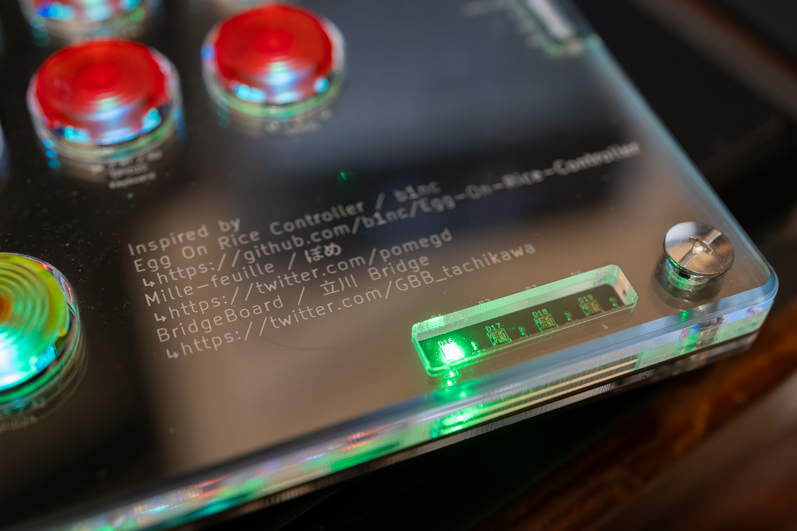

# Tri-Hard slab v2
## **[English](README.md) | 繁體中文**
使用 [GP2040-CE](https://gp2040-ce.info/) 0.7.5 版的薄型全按鍵控制器，為了《快打旋風 6》以及希望未來其他格鬥遊戲會跟進額外按鍵綁定的客製 15 鍵配置。

主要啟發自 [b1nc](https://github.com/b1nc) 的 [Egg On Rice Controller](https://github.com/b1nc/Egg-On-Rice-Controller)、[ぽめ](https://twitter.com/pomegd)的[Mille-feuille](https://pomegd.booth.pm/items/2685530)以及[立川 Bridge](https://twitter.com/GBB_tachikawa)的[BridgeBoard](https://bridgeshop.booth.pm/items/4869470)。

設計參考主要源自 [jfdeor2](https://github.com/jfedor2) 的 [flatbox](https://github.com/jfedor2/flatbox) rev4 以及 [TheTrain](https://github.com/TheTrainGoes) 和 [Lucipher](https://github.com/arntsonl) 的 [USB Passthrough Board](https://github.com/OpenStickCommunity/Hardware/tree/main/USB%20Passthrough%20Board)，後者採用 [CC 姓名標示 4.0](https://creativecommons.org/licenses/by/4.0/) 授權。

## 主要功能與規格
- 尺寸：270x157x15.6mm，下方有額外的海綿墊增加在腿上使用時的摩擦力，大約增加了 4mm 的厚度，總厚度大約是 20mm。
- 重量：約 800g。
- 雷射切割壓克力組成的外殼，有額外的背袋孔在上方。
- 主要按鍵軸體：凱華 Choc 矮軸 v2（紅軸），搭配熱插拔軸座與 PunkWorkshop 的鍵帽。
- 每個按鍵底下 1 個 RGB LED，以及 4 個 RGB LED 顯示玩家號碼（僅限 XInput 模式）。
- 使用 USB Type-C 為主要連接孔，額外的 USB Type-A 供 PS 通過驗證使用。
- 1.3 吋 OLED 螢幕來顯示各式資訊。
- 3 個滑動開關給專注模式（競技模式）、SOCD 模式與 LS / DP / RS 模式切換在右側。

各項功能的近照：

主要電路是參考 flatbox，有些元件因為短缺有所替換

常用的功能鍵是三個輕觸開關，和顯示螢幕一起在左上角，還有額外的滑動開關來對應不同針腳的螢幕

所有的滑動開關都在右側，雖然與壓克力外殼切齊但還是能輕易切換

雖然只有 XInput 模式會亮但有比沒有好

理論上是 PS5 相容（僅限格鬥遊戲）

## 生產用檔案

在等壓克力雷切完工時快速的算了一張 3D 圖

下載所有 Hardware files 資料夾中的檔案，就可以發給 PCB 生產廠商生產，我使用的是 JLCPCB。至於壓克力板切割，則請廠商依照每一個 dxf 檔案去切 1 塊，為了達到最佳效果，請指定跟檔名一樣的高度。
如果想要進一步完善的結果，可以請廠商依照額外的 STEP 檔案去做倒角或圓角，建議是至少做最上面那層的修飾，比較不刮手。

## 原始檔
Tri-Hard slab v2 使用 Autodesk Fusion 360 跟 KiCad 7.0 製作。
所有原始檔都在 Source files 資料夾內，除了 360 的檔案，但你可以直接匯入 dxf 再進行修改所以也不需要。KiCad 檔案有額外的 footprint，主要是一些可能可以互相替換用的元件，如果下訂板子時缺貨可以改用，但你會需要額外再調整一些線路。

## 組裝與設定

除了 PCB 與壓克力板，你需要購買一些額外的東西才能完成這個控制器：
- 當然是凱華矮軸，因為我一開始就打算用 PunkWorkshop 的按鍵，所以我用 v2。
- 15 個凱華矮軸熱插拔座（PG1350 用，相容 PG1353）
- 1.3 吋 OLED 螢幕，通常是 SH1106 驅動晶片，有些針腳 GND / VCC 位置會相反，記得用旁邊的滑動開關去調整
- 6 個 14mm 長度 的 M6 對鎖螺絲來將所有東西組裝在一起。

我並沒有自己編譯韌體，所以我直接從[這邊](https://gp2040-ce.info/#/download) 下載了 Raspberry Pi Pico 的版本，上傳到板子之後，按住 3P / RB / R1 按鍵（GPIO17）並連接到電腦上，在瀏覽器中輸入 192.168.7.1 開啟網路設定頁面，你可以上船我目前的設定檔 [setting files for v0.7.5](Setting%20files%20for%20GP2040-CE/gp2040ce_backup_20231024164547186.gp2040)，或是依照下方的資訊來手動設定所有的 GPIO 腳位：
|按鍵|GPIO|
|-|-|
|Up|14|
|Down|12|
|Left|11|
|Right|13|
|B1/1K/A/Circle|18|
|B2/2K/B/Cross|19|
|B3/1P/X/Square|15|
|B4/2P/Y/Triangle|16|
|L1/4P/LB|21|
|R1/3P/RB|17|
|L2/4K/LT|22|
|R2/3K/RT|20|
|S1/Select/Back|6|
|S2/Start|8|
|L3/LS|10|
|R3/RS|9|
|A1/Home/Guide|7|
|A2/Touch|24|

其他的 GPIO 跟 addons 設定如下：
|功能|GPIO and index|
|-|-|
|RGB LED Data Pin|3|
|Player LEDs|從 15 到 18|
|Display SDA|4|
|Display SCL|5|
|Joystick Selection Slider Pine 1|26|
|Joystick Selection Slider Pine 2|25|
|SOCD Cleaning Mode Selection Slider Pin 1|28|
|SOCD Cleaning Mode Selection Slider Pin 2|27|
|PS Passthrough D+|1|
|PS Passthrough D-|2 (automactically selected)|
|Focus Mode Pin|29|

## 姓名標示
請自由使用，主要你有註記來源自這個頁面。
[採用 CC 姓名標示 4.0](https://creativecommons.org/licenses/by/4.0/)
